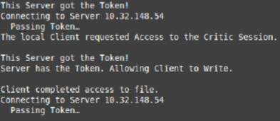

# TokenPassing
This repository contains the implementation of a solution for accessing a critic session using the Token Passing paradigm. 

In order to get this program up and running, a few setups must be made.

Initially, the linux must have installed the portmap program.

```sh
$ sudo apt-get install portmap
```

Following, a shared file must be created between all the clients, this way they can all access the same critic session. This shared file can be shared amongst multiple computers, i.e, using dropbox or sshfs. Or this file can be created in a single computer with multiple clients executing over it. This file is only necessary to contain a single number with no end line. I suggest the number 0, because *why not?*

Each client will perform an 10 arithmetic operation on the file number, print the operation and the result, one at a time in a time division multiplex access fashion.

It is necessary to modify the code to make it find this shared file. The file path can be set at line 83 of the *token_client.c* file.

After setting these up, the following commands must be typed in order to compile the software.

```sh
$ gcc –pthread token_server.c token_svc.c token_clnt.c –o server  
$ gcc token_clnt.c token_svc.c –o client 
$ gcc token_clnt.c starter.c –o starter
```

For running, one computer will hold the server, and the others will be clients. One of the clients also need to run a special client module called *starter*. The starter client will initialize all clients.

```sh
$ ./server  
$ ./client <localIP> <ID> 
```
After up setting up all clients, the starter module can be initialized.

```sh
$ ./starter 
```

Below, some screenshots of the program running:

### client


### server


### starter


### output file

